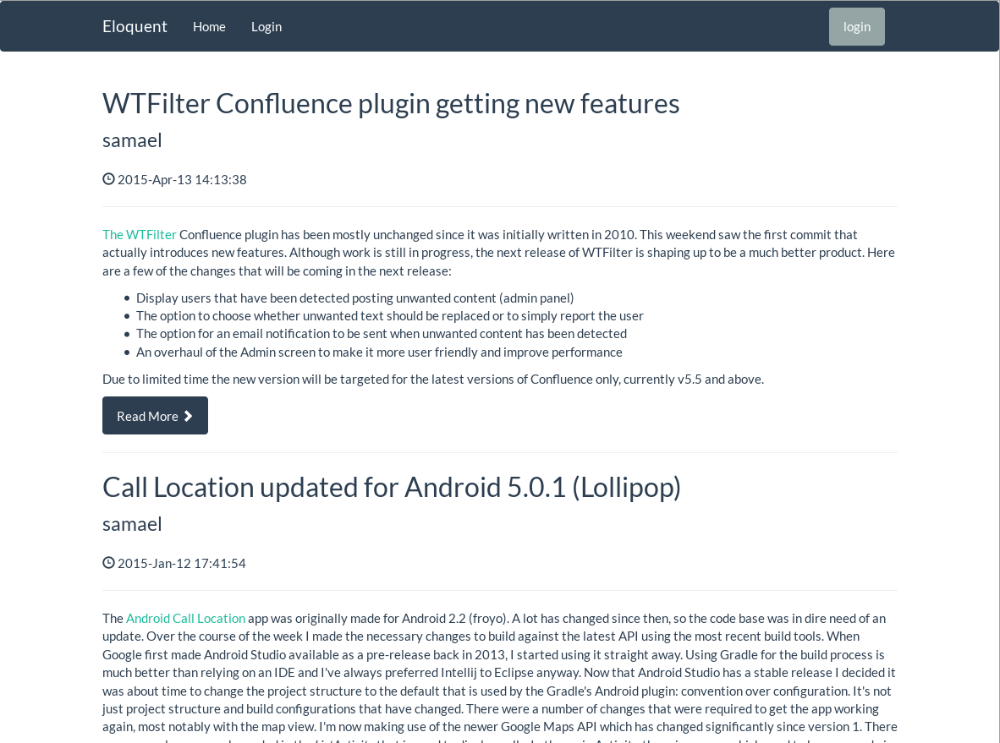

Eloquent
========

[](https://travis-ci.org/SingingBush/eloquent)

Eloquent is a lightweight web application written in [D](http://dlang.org). It is essentially an implementation of Wordpress. If you already have a Wordpress installation you can use the existing database and serve the content using Eloquent instead of the usual application written in PHP.

> This application is currently a work in progress and should only currently be used as an example of how to get going with developing web applications in D. Functionality is currently limited to merely displaying existing blog posts.



## Main dependencies

 - [Vibe.d](http://vibed.org) Asynchronous I/O web toolkit.
 - [Poodinis](https://github.com/mbierlee/poodinis) Dependency Injection Framework.
 - [Hibernated](https://github.com/buggins/hibernated) ORM for D.

## Yet to implement

 - editing/creating content
 - error handling (exceptions should result in a readable error page)
 - internationalisation

## Running the application

You'll need an existing wordpress database running on MySQL or Mariadb. The application looks for a file named `app.properties` that should be placed in the same directory as the compiled executable.

The properties file should contain your database connection details and path for an error log in the following format:

```
db.domain=localhost
db.port=3306
db.name=mywordpressdb
db.user=dbusername
db.password=dbPassword

log.file=eloquent-error.log
```

## Building

You'll need the D compiler and [DUB](http://code.dlang.org/download). The following versions or higher

 - dmd v2.069.2
 - dub v0.9.24

You will also need libevent on your system

Ubuntu:

```
sudo apt-get install libevent-dev
```

Fedora:

```
sudo dnf install libevent-devel
```

OSX:

```
brew install libevent
```