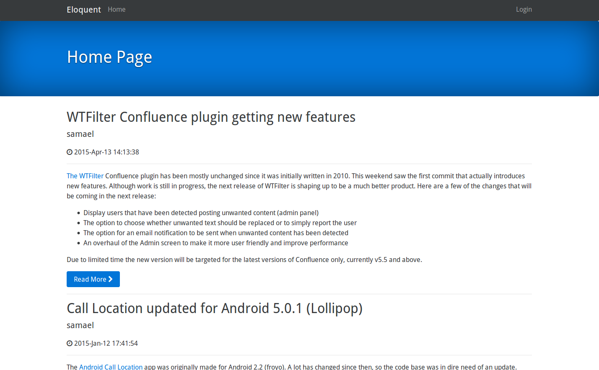

Eloquent
========


[](https://coveralls.io/github/SingingBush/eloquent?branch=master)

Eloquent is a lightweight web application written in [D](http://dlang.org). It is essentially an implementation of Wordpress. If you already have a Wordpress installation you can use the existing database and serve the content using Eloquent instead of the usual application written in PHP.

> This application is currently a work in progress and should only currently be used as an example of how to get going with developing web applications in D. Functionality is currently limited to merely displaying existing blog posts.



## Main dependencies

 - [Vibe.d](http://vibed.org) Asynchronous I/O web toolkit.
 - [Poodinis](https://github.com/mbierlee/poodinis) Dependency Injection Framework.
 - [Hibernated](https://github.com/buggins/hibernated) ORM for D.

## Yet to implement

 - editing/creating content
 - comments
 - internationalisation

## Running the application

You'll need an existing wordpress database running on MySQL or Mariadb. The application looks for a file named `app.properties` that should be placed in the same directory as the compiled executable.

The properties file should contain your database connection details and path for an error log in the following format:

```properties
http.port=80

## if not specified the db will default to SQLite
db.dialect=MySQL
db.domain=localhost
db.port=3306
db.name=mywordpressdb
db.user=dbusername
db.password=dbPassword
db.createSchema=false

auth.salt=RANDOMLY GENERATED 32-bit SALT HERE

# optional log settings. The default log level is info (options: verbose, debug, trace, error, info) with filename as eloquent-server.log
log.file=eloquent-server.log
log.level=trace
```

Or for a more minimal config for local development use SQLite:

```properties
db.dialect=SQLite
db.createSchema=true
```

## Building

You'll need a D compiler and [DUB](http://code.dlang.org/download). The following versions or higher

 - dmd v2.086.1 or ldc v1.16.0 (gdc may work if the front end is above 2.086.1 but is unsupported)
 - dub v1.14.0

If your system uses version 1.1 of OpenSSL (such as Fedora) use *VibeUseOpenSSL11* in the _versions_ of `dub.json`

### Build using dub

Release builds can be done using the _default_ configuration.

```bash
dub --compiler=ldc2
```

During development the _unittest_ configuration can be used if you only intend to use [sqlite](https://www.sqlite.org/).

```bash
dub --config=unittest
```

### Build dependencies (client side)

The front end uses jQuery, Bootstrap 4, and Font Awesome. These dependencies are handled via [Bower](http://bower.io/) which can be installed using npm

On Fedora nodejs and npm can be installed from the repository:

```
sudo dnf module enable nodejs:18
sudo dnf module install nodejs:18/development
```

Then install yarn globally:

```
sudo npm install -g yarn
```

There's no need to do a `bower install` as this will be done by dub during the build process.

### Build dependencies (server side)

You will also need libevent on your system

Ubuntu:

```
sudo apt-get install libevent-dev libsqlite3-dev libpq-dev
```

Fedora:

```
sudo dnf install libevent-devel openssl-devel sqlite-devel postgresql-devel unixODBC-devel
```

OSX:

```
brew install libev libevent sqlite
```

## Setting up the database

### Install Maria DB

Ubuntu: `sudo apt-get install mariadb-client mariadb-server`
Fedora: `sudo dnf install mariadb mariadb-server`

### Create the database and a user

```
CREATE DATABASE eloquent;
CREATE USER 'dbuser'@'localhost' IDENTIFIED BY 'passw0rd';
GRANT ALL PRIVILEGES ON eloquent.* TO 'dbuser'@'localhost';
FLUSH PRIVILEGES;
```

### Then import a SQL dump of a wordpress installation

```
mysql -u dbuser -p eloquent < wordpress-bak.sql
```

## Running behind Apache

### Make sure you have Apache installed:


```
sudo apt-get install apache2
```

### Configure a Virtual Host for use with the application `sudo vim /etc/apache2/sites-available/eloquent.conf` using the following content:

```
<VirtualHost *:80>
    ServerAdmin webmaster@example.com
    ServerName example.com
    ServerAlias www.example.com

    ErrorLog /var/log/apache2/mysite-error.log
    CustomLog /var/log/apache2/mysite-access.log common

    ProxyRequests off
    ProxyPreserveHost off
    ProxyPass / http://127.0.0.1:8080
    ProxyPassReverse / http://127.0.0.1:8080

</VirtualHost>
```

### Then make sure to enable the relevant mods and restart Apache

```
sudo vim /etc/apache2/sites-available/eloquent.conf
sudo a2enmod proxy proxy_http
sudo a2ensite eloquent
```

### Check the config and restart

Verfiy the Apache config with `apachectl configtest` then restart:


```
sudo systemctl restart apache2
```
